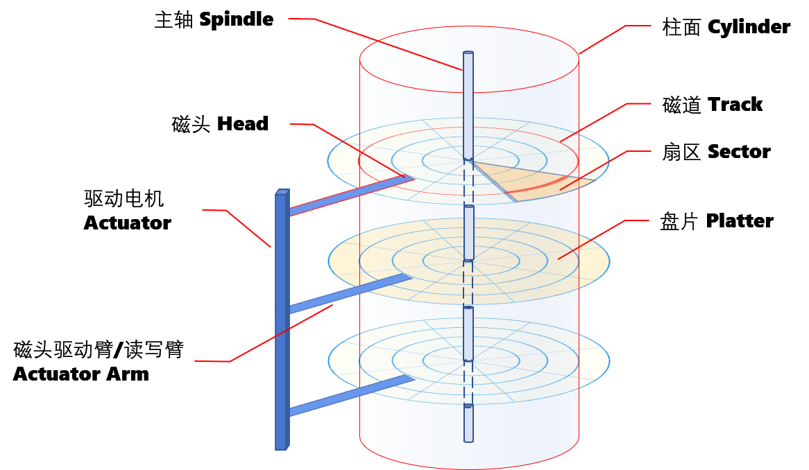
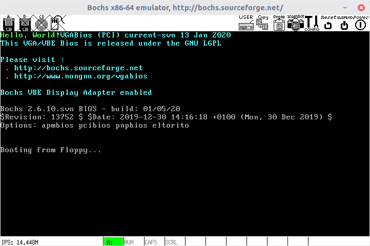
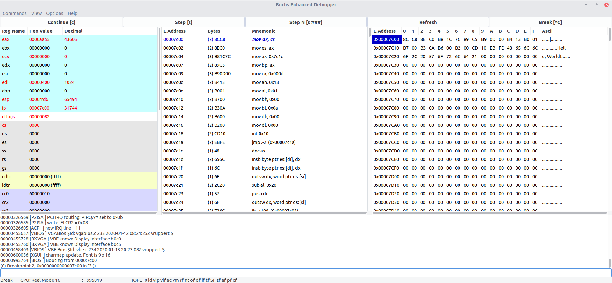

# 1 启动

## 预备知识：硬盘

传统机械硬盘（HDD，Hard Disk Drive）的相关概念。



其实硬盘是在3维空间建立了一个柱状坐标系。通过CHS（Cylinder Head Sector）即可定位到硬盘盘片上某一扇区，读写其数据。

- 磁道 Track：位于盘片上的同心圆。本质是一条磁化的区域，肉眼不可见。内外磁道间有间隔，避免相互影响。磁道从外向内，从0开始编号。
- 柱面 Cylinder：不同盘片的同一位置的磁道，构成一个柱面。柱面的范围是0~1023，由外向内。
  - 读写过程中，需要移动读写臂来调整到相应的柱面位置。这个需要磁盘寻道调度算法，来高效的利用磁盘。比如电梯调度算法。读写臂的内外移动，就如同电梯上下移动一般。硬盘会有一堆读写任务在排队，就好比有人按了楼层，在等待电梯。
- 扇区 Sector：包含了两种概念。
  - 几何扇区 Geometrical Sector：盘片上的扇装区域，范围是1~63。
    - 考虑连续读取两个扇区的情况。在读完一个扇区后，数据回传需要时间，又因为磁盘转速很高，当准备读取后面一个扇区时，磁头已经错过位置了，只能多转一圈再读。为了解决这个问题，扇区采取按照某隔跳来跃式地编号的方式，即扇区1后面隔几个才是扇区2，再隔几个才是扇区3。这样在读取扇区1，2，3时，不会因为回传数据错过下一个扇区，可能一圈之内都可以读取到。
  - 磁道扇区 Track Sector：磁道上的一段圆弧区域，存储容量是512字节。磁道扇区是读写的最小单位。**通常说的扇区是指磁道扇区。**
    - 随着存储技术的进步，2010年左右，开始支持4k大小的扇区了。
    - 早期的硬盘，每条磁道的扇区数是一样的。因此，内圈密度大，外圈密度小。随着技术发展，后来的硬盘，在物理上，内外磁道上的扇区数是不一样的了。不过，逻辑上还是认为每圈扇区数一样多。硬盘内部有一个转换算法来处理这个问题。
- 磁头 Head：读写磁性介质的部件。每个盘片都有一个磁头来读写。它们由驱动电机控制，同步移动。因此，在某一时刻，只有一个磁头在读写。磁头可以编号，范围是0~254 。但实际上一般在0~15之间，毕竟没有那么厚的硬盘支持上百个盘片。
    > 多臂读写（Multi Actuator）技术支持多个磁头独立移动，同时读写。但是读写臂的移动算法非常复杂，且不实用，没有太大发展。

如今的SSD（Solid State Drive）固态硬盘是完全不同的构造，已经没有这种机械结构了。不过，它有一个闪存转换层（Flash Translation Layer, FTL)来兼容上述的逻辑结构。因此，柱面，扇区等等概念还是存在的。

## 硬盘主引导记录（MBR）

硬盘主引导记录（MBR，Master Boot Record）指的是**0柱面，0磁头，1扇区**，也就是硬盘的第一个扇区的内容。由于历史原因，硬盘的一个扇区大小是512字节，包含最多446字节的启动代码、4个硬盘分区表项（每个表项16字节，共64字节）、2个签名字节（`0x55,0xAA`）。

当我们按下电源按钮时，主板加电自检，主板的基本输入出系统（BIOS，Basic Input/Output System）程序会将第一个扇区的数据装载到内存`0x7c00`处。然后开始执行启动代码。

## Hello World

本次实验不考虑分区表等复杂结构。

制作一张启动盘，在裸机的屏幕上打印出`Hello World!`。这里假定是x86的CPU。

> CPU的指令系统很重要，所以Linux系统安装盘一般有很多版本，适应于不同的CPU指令系统。如果不一致的话，即使代码被BIOS从MBR加载到内存，CPU执行不了就没意义了。
>
> 常见指令集：
>
> - **x86**： Intel（因特尔）公司发家的根基，是32位指令集。8086，80286，80386等等，统称为x86系列。
> - **AMD64**：AMD公司研发的64位指令集。它是在IA-32架构CPU上拓展而来，兼容16位和32位的x86指令，因此也称**x86-64**。
> - **Intel64**：Intel自己研究IA-64架构的CPU，效果不好。转而采纳AMD64，自己命名Intel 64。
> - **ARM**：由ARM Holdings（已被日本软银收购）设计的精简指令集。目前在移动手持设备上一统天下。
> - **MIPS**：最早由斯坦福大学研发的精简指令集。现在已成立MIPS科技公司。国内的龙芯CPU就取得了MIPS授权，借鉴MIPS开发的LoongISA指令集。
> - **PowerPC**：IBM的精简指令集。经常写成**ppc**。目前常见于大型机，超级计算机。

对于x86指令系统，可以使用BIOS中断指令**INT 10h**来打印字符串到屏幕。

> INT 10H，第17号中断向量
>
> 功能号AH = 13H，写字符串。
>
> 参数:
>
> - `AL`： 写模式，取值范围0~3。
>   - bit 0：写字符串后，更新光标位置到字符串后第一个位置。
>   - bit 1：字符串含有BIOS颜色属性，即对每个字符指定属性。字符串=字符，属性，字符，属性……（参见`BL`参数的介绍）
> - `BH`：页号
> - `BL`： 8bit BIOS颜色属性。bit7表示是否闪烁，bit6~4表示背景色, bit3~0表示前景色。显然，只有8种背景色，16种前景色。当然，也可以通过设置禁用闪烁功能，支持16种背景色。`BL`仅当`AL`的bit1=0时有效。
> - `CX`：字符串长度
> - `DH`, `DL`：写字符串的起始位置——行、列。（显然最多只有256行、列）
> - `ES:BP`：字符串的地址

```asm
; boot.asm: print "Hello World!" on screen

    org 07c00h   ; "0x7C00" is the memory address which BIOS loads 
                 ; MBR(Master Boot Record, a first sector in hdd/fdd) into.
    mov ax, cs
    mov es, ax              ; set es
    mov ax, Message
    mov bp, ax              ; set bp, es:bp = Hello World!
    mov cx, Fill - Message  ; length
    mov ah, 13h             ; function : write string
    mov al, 01h             ; write mode
    mov bh, 0               ; page number
    mov bl, 0ah             ; background color=black, foreground color=light green
    mov dh,    0            ; row 0
    mov dl, 0               ; column 0
    int 10h                 ; BIOS interrupt call
    jmp $                   ; jump to current address (= infinite loop)
Message:    db "Hello, World!"       ; string data
Fill:       times 510-($-$$)  db 0   ; first sector (512 bytes) 
                                     ; |program data| ....any data ...|0xaa, 0x55|
                                     ;  0            ($-$$)        509  510   511
                                     ; $$ is the address of the beginning of the current section
            dw 0xaa55       ; boot signature = end of the first sector
```

以上代码为nasm语言。编译，

```shell
nasm boot.asm -o boot.bin
```

## Bochs虚拟机

用裸机来实验太不方便，因此使用Bochs虚拟机。Bochs是一款模拟IA-32 (x86) CPU的虚拟机。

先配置如下一台机器。

```properties
# bochsrc.txt

cpu: model=pentium, count=1

memory: guest=512, host=256

romimage: file=$BXSHARE/BIOS-bochs-latest, options=fastboot

vgaromimage: file=$BXSHARE/VGABIOS-lgpl-latest

mouse: enabled=0
keyboard: type=mf, keymap=$BXSHARE/keymaps/x11-pc-us.map

floppya: 1_44=a.img, status=inserted, write_protected=1

boot: floppy

log: bochsout.txt
```

其中的软盘`a.img`就是要制作的启动盘。

首先使用bochs自带的bximage工具，创建1.44M软盘。

```sh
bximage -mode=create -fd=1.44M -q a.img
```

> bximage默认是交互式操作的程序。`-q`是静默模式。

然后用Linux的`dd`命令把`boot.bin`写入软盘`a.img`。

```sh
dd if=boot.bin of=a.img bs=512 count=1 conv=notrunc
```

现在就可以`bochs`命令，开始运行了。



## 调试

Bochs最好从源码编译，以便定制功能。

```shell
~: ./configure --enable-debugger --enable-disasm
~: make
~: make install
```

在`bootsrc.txt`和`a.img`的目录下，运行`bochs`命令。当然，此时会自动进入调试模式。在提示符下键入`c`，即继续执行（continue）。虚拟机的屏幕上就打印出“Hello World!”了。然后陷入死循环。`Ctrl+C`退出即可。

> 键入`h`，查看更多调试命令。比如`b`设置断点，`r`查看通用寄存器。

如果使用自带的GUI调试器，则需要在编译时加入`--enable-debugger-gui`选项。以Linux为例，需要在`bochsrc.txt`中添加
```
display_library: x, options="gui_debug"
```
> 理论上在Windows环境下，只需要将x改成win32即可。但是，此处似乎有bug导致Wind环境不能用调试器。

调试界面如下图所示（停在断点`0x7c00`处）。
