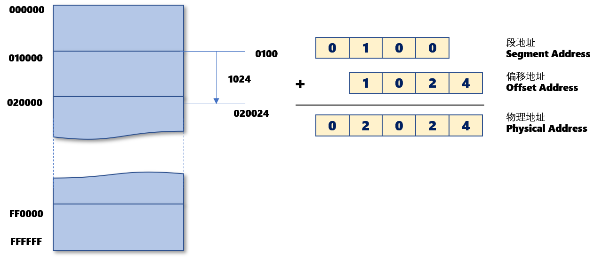
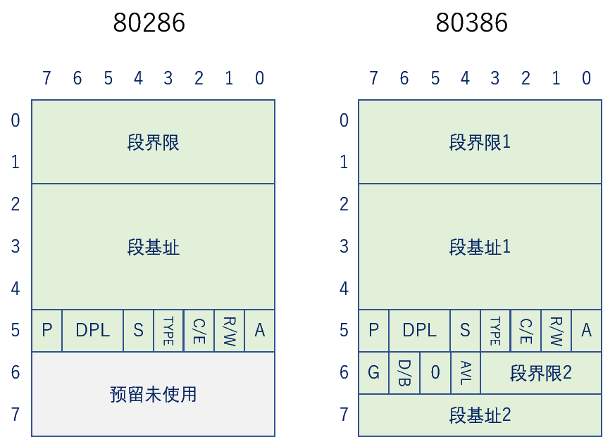
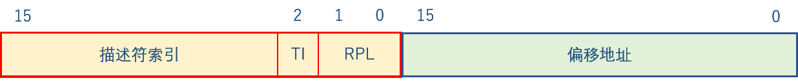

# 保护模式

## x86运行模式

### 实模式（Real Mode）

8086时代的处理器只有20根地址线。

寻址寄存器是16位，可以访问2^16 = 64K的地址空间。如果程序要想访问大于64K的内存，就需要把内存分段，每段64K。每段开头的地址也是用16位寄存器来运算，一共2^16=64个段。物理内存的任一地址可以用段地址（段开头的地址）和偏移量（从段地址起算的距离）的方式来访问。这样使20根地址线全用上，最大的寻址空间就可以到1M字节。

显然，64个段，每段64k，这个空间是远超1M字节的。问题就是CPU内的地址线只有20条，这是个上限。实际上，在内存中64个段其实是重叠的，总体就是00000~FFFFF共1M空间。

例如：栈空间就是位于栈段（Stack Segment），由寄存器SS存储段地址。栈底位置是相对于SS的一个偏移地址，由基址指针寄存器BP（Base Pointer）存储。栈顶位置是相对于SS的一个偏移地址，由栈指针寄存器SP（Stack Pointer）存储。

实模式除了空间有限的问题，还有一个问题是对物理内存没有权限管理。普通用户可以覆盖或直接读写操作系统的指令或数据，这非常不安全。

### 保护模式（Protect Mode）

从80286开始，x86引入了保护模式。到了80386，正式确定了IA-32架构的保护模式。

在保护模式下，段不能简单地用一个地址来表示。他需要一些额外信息来控制段的属性，比如读写权限等等。因此，一个8字节的结构就被设计出来了，称为段描述符（Descriptor）。

80286的CPU有24根地址线，可寻址16M物理内存。描述符中段基址占3字节，2^24=16M空间中任何一个位置都可以当作段基址。 段界限即段的长度，占2字节，因此段的长度不超过2^16=64K字节。

使用了描述符之后，8个字节有64位，显然不可能直接将描述符装到32位寄存器中去。于是，有了段选择子（Selector）。选择子有16位，因此很容易被装到寄存器里面去。

图中TI指Table Index。它是切换两个描述符表，全局描述符表（Global Descriptor Tale，GDT）和局部描述符表（Local Descriptor Table，LDT）。前面13位是描述符的索引号。因此，一共可以表示2^13 * 2 = 2^ 14个描述符，即64K个段。从16位偏移地址可知，每段最长2^16=64K空间。因此一共的虚拟地址空间是 2^14*64K=1G空间。

80386的CPU有32根地址线。因此描述符里的段基址有32位，即2^32=4G空间的任意位置可以作为段基址。段界限也拓展为24位，即每段最大空间达到 2^ 24=16M字节。